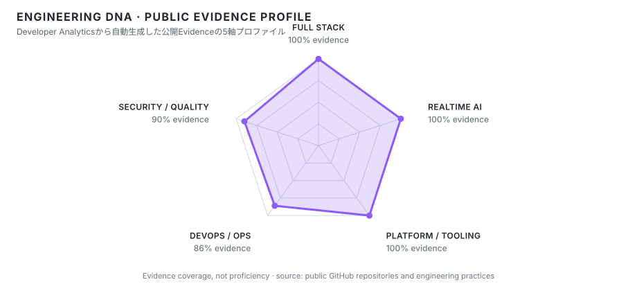

<a href="./README.md">日本語</a> · <strong>English</strong>

  

<h1 align="center">Ivoru / mizzz</h1>

  <strong>Product-minded Full Stack Developer</strong> 
  Building web products, realtime AI, Discord systems, APIs, databases and operations end to end.

  
  
  

---

## Core technologies

  
  
  
  
  
  

## What I work on

`Full Stack` `Web Product` `Realtime AI` `Discord` `Platform / Tooling` `DevOps / Observability`

<!-- ENGINEERING-DNA:START -->
## ENGINEERING DNA // Public evidence profile

Generated from public repositories, engineering practices and assignment evidence. See <a href="./reports/developer-analytics.en.md">Developer Analytics</a> for details.

<!-- ENGINEERING-DNA:END -->

---

## Selected public projects

- **[Herta](https://github.com/ivRooom/Herta)** — Discord Community Operating System with NestJS, Next.js, Discord Bot, BullMQ, PostgreSQL and Redis.
- **[RooMate Voice](https://github.com/mizzz-ivr/roomate-voice)** — Discord Voice × OpenAI Realtime voice AI and Windows desktop application.
- **[ivmz-home](https://github.com/mizzz-ivr/ivmz-home)** — Personal web / portfolio platform with Next.js, Payload and PostgreSQL.
- **[IVRM Dashboard](https://github.com/ivRooom/ivrm-dashboard)** — Operations / observability console using Next.js, Supabase and a Go agent.

## Documents

- [Skill Sheet](./SKILL_SHEET.en.md)
- [Developer Analytics](./reports/developer-analytics.en.md)

## Links

- Website: https://ivmz.ivrm.jp
- GitHub: https://github.com/mizzz-ivr
- Community: https://ivrm.jp
- Contact: ivmz@ivrm.jp

For live development activity, see the [Japanese profile](./README.md).
