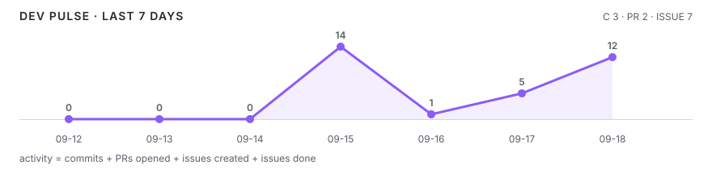

  

<h1 align="center">いゔる。 a.k.a. mizzz（ずーみー）</h1>

  <strong>Product-minded Full Stack Developer</strong> 
  React / TypeScript を軸に、Web・Discord・Realtime AI・API・DB・運用までつなげて実装しています。 

  
  
  

  BUILD SMALL · POLISH FAST · OPERATE SAFELY

---

<!-- PROFILE-SIGNAL:LIVE-SIGNAL:START -->
## LIVE SIGNAL // Development status

<table>
  <tr>
    <td width="33%" align="center"><strong>● BUILDING</strong> last public activity · 18:12 JST</td>
    <td width="34%" align="center"><strong>🌩️ STORM</strong> 451 public actions today</td>
    <td width="33%" align="center"><strong>🔥 3 DAY STREAK</strong> public activity · recent history</td>
  </tr>
</table>
<!-- PROFILE-SIGNAL:LIVE-SIGNAL:END -->

<!-- DAILY-ACTIVITY:START -->
## TODAY // Activity overview

  2026-08-27 JST · public GitHub activity

<table>
  <tr>
    <td width="25%" align="center"><strong>388</strong> COMMITS</td>
    <td width="25%" align="center"><strong>33</strong> PRS OPENED</td>
    <td width="25%" align="center"><strong>15</strong> ISSUES CREATED</td>
    <td width="25%" align="center"><strong>15</strong> ISSUES DONE</td>
  </tr>
</table>

Auto-updated by GitHub Actions · recent events are shown in ACTIVITY STREAM

<!-- DAILY-ACTIVITY:END -->

<!-- PROFILE-SIGNAL:FOCUS:START -->
## CURRENT FOCUS // What is moving now

<table>
  <tr>
    <td width="62%" valign="top"><strong><a href="https://github.com/mizzz-ivr/tech-writing">mizzz-ivr/tech-writing</a></strong> 24% of weighted repository activity · score 92 · 62 events</td>
    <td width="38%" valign="top"><strong>TODAY&apos;S STACK</strong> <code>Python</code></td>
  </tr>
</table>

Focus uses weighted public GitHub events; repository language data comes from the current focus repository.

<!-- PROFILE-SIGNAL:FOCUS:END -->

<!-- PROFILE-SIGNAL:PULSE:START -->
## DEV PULSE // Last 7 days

  

<table>
  <tr>
    <td width="25%" align="center"><strong>! ATTENTION</strong> CI SIGNAL · last 7 days</td>
    <td width="25%" align="center"><strong>83%</strong> PASS RATE</td>
    <td width="25%" align="center"><strong>20 / 24</strong> PASSED / EVALUATED</td>
    <td width="25%" align="center"><strong>3</strong> REPOS WITH CI</td>
  </tr>
</table>

GitHub Actions · completed runs from active repositories · cancelled / skipped / neutral runs are excluded from pass rate

<!-- PROFILE-SIGNAL:PULSE:END -->

<!-- PROFILE-SIGNAL:NOW-BUILDING:START -->
## NOW BUILDING // Active repositories

<table>
  <tr>
    <td width="33%" valign="top"><strong>01 · <a href="https://github.com/mizzz-ivr/tech-writing">mizzz-ivr/tech-writing</a></strong> 24% weighted activity · score 92 · 62 events ◐ WATCH · CI · 7/8 passed · 88% last activity · 18:12 JST</td><td width="33%" valign="top"><strong>02 · <a href="https://github.com/ivRooom/Herta">ivRooom/Herta</a></strong> 21% weighted activity · score 81 · 74 events ! ATTENTION · CI · 4/6 passed · 67% last activity · 17:54 JST</td><td width="33%" valign="top"><strong>03 · <a href="https://github.com/mizzz-ivr/profile-signal">mizzz-ivr/profile-signal</a></strong> 17% weighted activity · score 66 · 50 events ● HEALTHY · CI · 9/10 passed · 90% last activity · 13:57 JST</td>
  </tr>
</table>

Ranked by weighted public GitHub activity · health combines repository recency with recent GitHub Actions signal

<!-- PROFILE-SIGNAL:NOW-BUILDING:END -->

<!-- PROFILE-SIGNAL:ACTIVITY-STREAM:START -->
## ACTIVITY STREAM // Latest public signals

<table>
  <tbody>
    <tr><td width="10%"><code>18:12</code></td><td width="14%"><code>ISSUE</code></td><td><strong><a href="https://github.com/mizzz-ivr/tech-writing">mizzz-ivr/tech-writing</a></strong> — <a href="https://github.com/mizzz-ivr/tech-writing/issues/23">Opened issue #23</a></td></tr>
    <tr><td width="10%"><code>17:54</code></td><td width="14%"><code>PUSH</code></td><td><strong><a href="https://github.com/ivRooom/Herta">ivRooom/Herta</a></strong> — <a href="https://github.com/ivRooom/Herta/commits">1 commit pushed to main</a></td></tr>
    <tr><td width="10%"><code>17:54</code></td><td width="14%"><code>PR</code></td><td><strong><a href="https://github.com/ivRooom/Herta">ivRooom/Herta</a></strong> — <a href="https://github.com/ivRooom/Herta">PR merged #347</a></td></tr>
    <tr><td width="10%"><code>17:41</code></td><td width="14%"><code>ISSUE</code></td><td><strong><a href="https://github.com/ivRooom/ivrm-member-site">ivRooom/ivrm-member-site</a></strong> — <a href="https://github.com/ivRooom/ivrm-member-site/issues/56">Closed issue #56</a></td></tr>
  </tbody>
</table>
<!-- PROFILE-SIGNAL:ACTIVITY-STREAM:END -->

---

<!-- DEVELOPER-ANALYTICS:START -->
## ENGINEERING PROFILE // Public evidence

公開Repositoryの実装・構成・技術選定・開発プロセスを、営業・受託・フリーランス・案件アサインでも再利用できるEvidenceとして整理しています。  
**Evidence Scoreは能力点ではなく、公開GitHub上で確認できる証拠の強さです。公開Evidenceが無いことを未経験とは扱いません。**

### Core technology signals

| Technology | Evidence | Projects |
| --- | --- | --- |
| React | REPEATED | 6 |
| Docker | REPEATED | 5 |
| TypeScript | REPEATED | 5 |
| PostgreSQL | REPEATED | 4 |
| Next.js | ESTABLISHED | 3 |
| Python | ESTABLISHED | 3 |
| Tailwind CSS | ESTABLISHED | 3 |
| Playwright | ESTABLISHED | 2 |

### Engineering range

`full-stack` `frontend` `backend-api` `realtime-ai` `desktop-app` `developer-platform` `observability` `infrastructure`

### How I ship

`repository-driven-development` `security-by-design` `automated-testing` `accessibility-first` `observability` `least-privilege` `fail-close` `release-automation`

### Assignment evidence coverage

| Area | Public evidence coverage |
| --- | ---: |
| Discord / Community Systems | 100% |
| Full-stack Product Development | 100% |
| Platform / Developer Tooling | 100% |
| Realtime AI / Voice | 100% |
| DevOps / Observability | 86% |

Bootstrap from curated public evidence · live GitHub recency / PR / Issue / delivery signals are collected only when Developer Analytics is run manually · <a href="./SKILL_SHEET.md">SKILL_SHEET.md</a> · <a href="./reports/developer-analytics.md">Detailed analytics</a>

<!-- DEVELOPER-ANALYTICS:END -->

---

## PUBLIC BUILDS // Selected evidence

<table>
  <tr>
    <td width="50%" valign="top">
      <h3><a href="https://github.com/ivRooom/Herta">Herta</a></h3>
      
<strong>Discord Community Operating System / Platform</strong>

      
NestJS API、Next.js Studio、Discord Bot、BullMQ Worker、Plugin Runtime、PostgreSQL / Redisを含むモノレポ。

      
<code>TypeScript</code> <code>NestJS</code> <code>Next.js</code> <code>PostgreSQL</code> <code>Redis</code>

    </td>
    <td width="50%" valign="top">
      <h3><a href="https://github.com/mizzz-ivr/roomate-voice">RooMate Voice</a></h3>
      
<strong>Discord × Realtime AI Voice / Windows Desktop</strong>

      
Realtime音声AI、Discord Voice、barge-in、Secret保護、Electron Desktop、Installer / Releaseまで扱うOSS。

      
<code>TypeScript</code> <code>OpenAI Realtime</code> <code>Discord Voice</code> <code>Electron</code> <code>Docker</code>

    </td>
  </tr>
  <tr>
    <td width="50%" valign="top">
      <h3><a href="https://github.com/mizzz-ivr/ivmz-home">ivmz-home</a></h3>
      
<strong>Personal Web / Portfolio Platform</strong>

      
Next.js / Payload / PostgreSQLを軸に、CMS、SEO、Accessibility、Testing、運用可搬性まで含めるWeb Platform。

      
<code>Next.js</code> <code>React</code> <code>Payload</code> <code>PostgreSQL</code> <code>Playwright</code>

    </td>
    <td width="50%" valign="top">
      <h3><a href="https://github.com/ivRooom/ivrm-dashboard">IVRM Dashboard</a></h3>
      
<strong>Operations / Observability Platform</strong>

      
Next.js + Supabase + Go AgentでMinecraft / Web / Cloud基盤を安全に監視する統合運用コンソール。

      
<code>TypeScript</code> <code>Next.js</code> <code>Go</code> <code>Supabase</code> <code>Docker</code>

    </td>
  </tr>
</table>

Selected projects are public implementation evidence. Additional projects and evidence are included in the generated Skill Sheet.

---

<!-- PROFILE-SIGNAL:RECAP:START -->
## DEV RECAP // Tracked history

<table>
  <tr>
    <td width="25%" align="center"><strong>3</strong> ACTIVE DAYS · THIS WEEK</td>
    <td width="25%" align="center"><strong>1017</strong> COMMITS · THIS WEEK</td>
    <td width="25%" align="center"><strong>71</strong> PRS OPENED · THIS WEEK</td>
    <td width="25%" align="center"><strong>19</strong> ISSUES DONE · THIS WEEK</td>
  </tr>
</table>

2026-W35 · tracked since 2026-08-25 · CI · 83% · 20/24 passed

<strong>MONTHLY BUILD REPORT + ACHIEVEMENTS</strong>

 

<table>
  <tr>
    <td width="20%" align="center"><strong>3</strong> ACTIVE DAYS</td>
    <td width="20%" align="center"><strong>1017</strong> COMMITS</td>
    <td width="20%" align="center"><strong>71</strong> PRS OPENED</td>
    <td width="20%" align="center"><strong>19</strong> ISSUES DONE</td>
    <td width="20%" align="center"><strong>1133</strong> ACTIVITY</td>
  </tr>
</table>

<strong>2026-08 // tracked report</strong>

<code>📡 FIRST SIGNAL</code> <code>🏗️ 100+ COMMITS</code> <code>🚢 10+ PRS</code> <code>✅ 10+ ISSUES DONE</code> <code>⚡ 1K ACTIVITY</code>

Achievements and reports are based only on Profile Signal tracked public history, not lifetime GitHub totals.

<!-- PROFILE-SIGNAL:RECAP:END -->

---

## SIGNAL // Links

  
  
  
  
  
  

  
  
  
  
  
  

  Activity widgets are maintained by Profile Signal; Developer Analytics and the Skill Sheet are maintained only in this profile repository.

