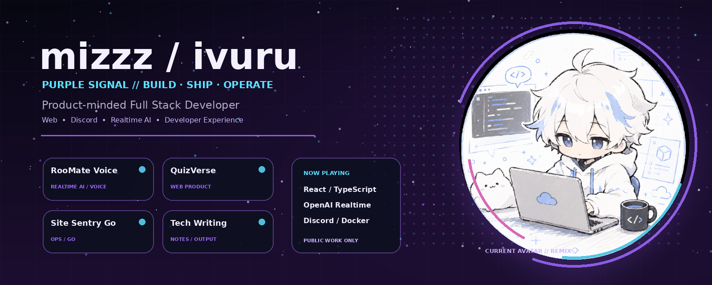
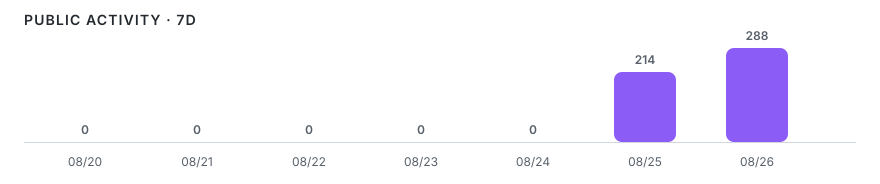
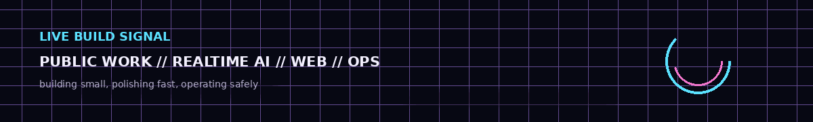

<p align="center">
  
</p>

<h1 align="center">いゔる。 a.k.a. mizzz（ずーみー）</h1>

<p align="center">
  <strong>Product-minded Full Stack Developer</strong><br/>
  React / TypeScript を軸に、Web・Discord・Realtime AI・API・DB・運用までつなげて実装しています。<br/>
  <sub>SNSでは「いゔる。」、開発者名義では「mizzz（ずーみー）」を使用しています。</sub>
</p>

<p align="center">
  <a href="https://mizzz.ivrm.jp"></a>
  <a href="https://ivrm.jp"></a>
  <a href="mailto:mizzz@ivrm.jp"></a>
</p>

<p align="center">
  <sub>BUILD SMALL · POLISH FAST · OPERATE SAFELY</sub>
</p>

---

<!-- DAILY-ACTIVITY:START -->
## TODAY // Activity overview

<p align="center">
  <sub>2026-08-26 JST · public GitHub activity</sub>
</p>

<table>
  <tr>
    <td width="25%" align="center"><strong>87</strong><br/><sub>COMMITS</sub></td>
    <td width="25%" align="center"><strong>13</strong><br/><sub>PRS OPENED</sub></td>
    <td width="25%" align="center"><strong>3</strong><br/><sub>ISSUES CREATED</sub></td>
    <td width="25%" align="center"><strong>1</strong><br/><sub>ISSUES DONE</sub></td>
  </tr>
</table>

<strong>Today&apos;s signal</strong>

<ul>
  <li><code>COMMIT</code> <strong><a href="https://github.com/mizzz-ivr/mizzz-ivr">mizzz-ivr/mizzz-ivr</a></strong> — <a href="https://github.com/mizzz-ivr/mizzz-ivr/commit/1af10d237fb758298c806067404fc955dc58692d">Merge pull request #18 from mizzz-ivr/feat/profile-daily-activity  feat: add automated daily Git</a></li>
  <li><code>COMMIT</code> <strong><a href="https://github.com/mizzz-ivr/mizzz-ivr">mizzz-ivr/mizzz-ivr</a></strong> — <a href="https://github.com/mizzz-ivr/mizzz-ivr/commit/af996428d0dbc3977c92f85269a28ccb89c7d776">ci: validate activity generator on pull requests</a></li>
  <li><code>COMMIT</code> <strong><a href="https://github.com/mizzz-ivr/mizzz-ivr">mizzz-ivr/mizzz-ivr</a></strong> — <a href="https://github.com/mizzz-ivr/mizzz-ivr/commit/09481ff90bcabb08ca77716212582d6d30e95ace">feat: add daily activity section to profile</a></li>
  <li><code>COMMIT</code> <strong><a href="https://github.com/mizzz-ivr/mizzz-ivr">mizzz-ivr/mizzz-ivr</a></strong> — <a href="https://github.com/mizzz-ivr/mizzz-ivr/commit/7c2f9936e38b831c0fb495b06e7dbef2612b9ab7">ci: automate profile activity refresh</a></li>
  <li><code>COMMIT</code> <strong><a href="https://github.com/mizzz-ivr/mizzz-ivr">mizzz-ivr/mizzz-ivr</a></strong> — <a href="https://github.com/mizzz-ivr/mizzz-ivr/commit/99d974ca85dd5da3573641d0c17c1ebfddd23f0f">feat: add profile activity collector</a></li>
</ul>

<p align="center">
  
</p>

<p align="center">
  <sub>Auto-updated by GitHub Actions · Issue done = authored issue closed as completed</sub>
</p>
<!-- DAILY-ACTIVITY:END -->

---

## NOW // What I build

<table>
  <tr>
    <td width="25%" align="center"><strong>WEB</strong><br/><sub>React / TypeScript</sub></td>
    <td width="25%" align="center"><strong>AI</strong><br/><sub>Realtime / Agents</sub></td>
    <td width="25%" align="center"><strong>COMMUNITY</strong><br/><sub>Discord / Voice</sub></td>
    <td width="25%" align="center"><strong>OPS</strong><br/><sub>Docker / CI / Cloud</sub></td>
  </tr>
</table>

アイデアを画面だけで終わらせず、API・データ・権限・ログ・デプロイ・運用まで含めて「使える状態」にすることを重視しています。個人開発では、実装と同じくらい README / Issue / Docs / CI を整え、Repository を開発判断の Source of Truth として扱います。

<p align="center">
  
</p>

---

## PUBLIC BUILDS // Featured

<table>
  <tr>
    <td width="50%" valign="top">
      <h3><a href="https://github.com/mizzz-ivr/roomate-voice">RooMate Voice</a></h3>
      <p><strong>Discord × Realtime AI Voice Bot</strong></p>
      <p>Discord VCで自然に音声会話するOSS Bot。音声入出力、OpenAI Realtime、割り込み、Persona、管理Dashboard、Docker / Lightsail運用まで実装。</p>
      <p><code>TypeScript</code> <code>React</code> <code>OpenAI Realtime</code> <code>Discord</code> <code>Docker</code></p>
    </td>
    <td width="50%" valign="top">
      <h3><a href="https://github.com/mizzz-ivr/quizverse">QuizVerse</a></h3>
      <p><strong>Interactive Quiz & Learning Platform</strong></p>
      <p>クイズ作成・公開・プレイ・ランキング・レビュー・お気に入り・学習履歴・管理機能まで扱うWebプラットフォーム。</p>
      <p><code>React</code> <code>Vite</code> <code>Flask</code> <code>PostgreSQL</code> <code>Docker</code></p>
    </td>
  </tr>
  <tr>
    <td width="50%" valign="top">
      <h3><a href="https://github.com/mizzz-ivr/site-sentry-go">Site Sentry Go</a></h3>
      <p><strong>Lightweight Website Monitor</strong></p>
      <p>複数URLの定期監視、UP/DOWN、応答時間、履歴、手動チェックを扱う軽量な死活監視ツール。</p>
      <p><code>Go</code> <code>SQLite</code> <code>HTTP</code> <code>Docker</code></p>
    </td>
    <td width="50%" valign="top">
      <h3><a href="https://github.com/mizzz-ivr/tech-writing">Tech Writing</a></h3>
      <p><strong>Engineering Notes & Publishing Source</strong></p>
      <p>個人開発で得た知見をQiita・Zenn・SNSへ継続的に発信するための原稿・検証メモ・公開記録のSource of Truth。</p>
      <p><code>Docs</code> <code>Technical Writing</code> <code>Repository-driven</code></p>
    </td>
  </tr>
</table>

> Featured は、現在 **public かつ自作のリポジトリ**だけで構成しています。

---

## STACK // Public workで使っている技術

<table>
  <tr>
    <td><strong>Frontend</strong></td>
    <td>React / TypeScript / JavaScript / Vite / Tailwind CSS</td>
  </tr>
  <tr>
    <td><strong>Backend</strong></td>
    <td>Node.js / Python / Flask / Go</td>
  </tr>
  <tr>
    <td><strong>Data</strong></td>
    <td>PostgreSQL / SQLite</td>
  </tr>
  <tr>
    <td><strong>AI & Community</strong></td>
    <td>OpenAI Realtime API / Discord.js / Discord Voice</td>
  </tr>
  <tr>
    <td><strong>Delivery & Ops</strong></td>
    <td>Docker / Docker Compose / GitHub Actions / Vercel / AWS Lightsail</td>
  </tr>
</table>

<p align="center">
  
  
  
  
  
  
  
</p>

---

## BUILD LOGIC // How I work

```text
01. Start from value    — 価値の中心から小さく実装して、早く触れる状態にする
02. Polish the path     — UIだけでなく導線・速度・レスポンシブ・操作感まで磨く
03. Ship with safety    — 認証・権限・ログ・監視・復旧を後付けにしない
04. Keep the repo true  — README / Issue / Docs / CIを実装と一緒に更新する
05. Use AI with review  — AIを開発に使い、設計判断と品質責任は人間が持つ
```

---

## PUBLIC REPOSITORIES // Index

**Original work**

- [RooMate Voice](https://github.com/mizzz-ivr/roomate-voice) — Discord × Realtime AI voice bot
- [QuizVerse](https://github.com/mizzz-ivr/quizverse) — quiz / learning web platform
- [Site Sentry Go](https://github.com/mizzz-ivr/site-sentry-go) — lightweight website monitor
- [Tech Writing](https://github.com/mizzz-ivr/tech-writing) — engineering article source & publishing log

<details>
  <summary><strong>Public forks / references</strong></summary>
  <br/>
  <p>以下は公開リポジトリですが、自作プロダクトと誤認されないようFeaturedから分離しています。</p>
  <ul>
    <li><a href="https://github.com/mizzz-ivr/hermes-agent">hermes-agent</a> — fork of NousResearch/hermes-agent</li>
    <li><a href="https://github.com/mizzz-ivr/claw-code">claw-code</a> — fork of ultraworkers/claw-code</li>
    <li><a href="https://github.com/mizzz-ivr/hoyolab-auto-daily">hoyolab-auto-daily</a> — fork of sglkc/hoyolab-auto-daily</li>
  </ul>
</details>

---

## SIGNAL // Links

<p align="center">
  <a href="https://mizzz.ivrm.jp">Portfolio</a> ・
  <a href="https://ivrm.jp">ivRooom</a> ・
  <a href="https://github.com/mizzz-ivr">GitHub</a> ・
  <a href="mailto:mizzz@ivrm.jp">Contact</a>
</p>

<p align="center">
  <sub>Profile visuals are generated in-repository from the current GitHub avatar and the public project set.</sub>
</p>
